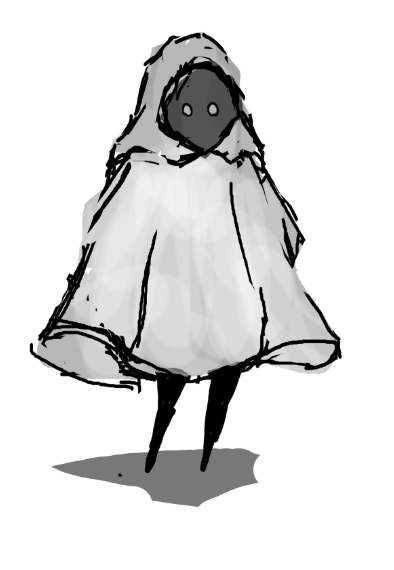

# Absorber
-----
-----

## 프로젝트 소개

 - 제목 : Absorber
 - 장르 : 뱀서라이크(무한히 다가오는 적들을 물리치는 류)
 - 특징 : 높은 랜덤성, 스토리
 - 사용하는 언어 : C#(Unitiy)

  Absorber는 무한히 다가오는 몬스터들에 맞서 싸워 탑의 정상을 향해가는 뱀서라이크류 게임입니다. 기존 뱀서라이크 류 게임에 없던 스토리와 높은 랜덤성을 부여해 일회성 플레이와 다회성 플레이에 의미를 부여합니다. 

## Abstract

-   Title: Absorber
-   Genre:  Games Like Vampire Survivors(a type of game where the player defeats endlessly approaching enemies)
-   Features: High randomness, story
-   Language used: C# (Unity)

 
Absorber is a Games Like Vampire Survivors where the player fights against endless waves of monsters to reach the top of a tower. It features a unique story and high randomness that give meaning to both one-time and repeated plays. 
 
## 스토리

어느 날 기억을 잃고 일어난 엘리엇은 혼란스러운 밤을 맞이한다. 그에게 남은 것은 없다. 알 수 없음에 끌려 그는 탑을 행해 걸어간다. 그는 탑을 오른다. 그는 학살한다. 그는 기억을 되찾는다. 점점 밝혀지는 기억 속에서 그가 선택할 최후는... ...

----
## 게임 이미지, 영상

----
## 설치 방법

추후 업데이트

## 팀원 소개

 
 팀장 20163199 김중현                               | 20143074 심효창                                   |  20171613 김효종 | 
 ----| ----| ----| 
  | | |
 Tel. 010-8355-8893   E-mail. gotka0211@gmail.com|Tel. 010-3808-1981   E-mail. 94shch@naver.com   |Tel. 010-2518-6146   E-mail. kim97072481@gmail.com|
 

 20183438 조성민                                     | 20203151 최신영                                   |  20203161 한태원 | 
 ----|----|  ----|
   | |  |
 Tel. 010-3478-3315   E-mail. tjdals9709@naver.com| Tel. 010-7210-2326   E-mail. siny0626@gmail.com| Tel. 010-9347-2444   E-mail. hantawon@naver.com|
