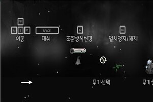

## 1. 프로젝트 소개

제목 : Absorber

장르 : 뱀서라이크(무한히 다가오는 적들을 물리치는 류)

사용하는 언어 : C#(Unitiy)

게임 진행 방식 : 스테이지(일반->보스)

특징 
- 컨셉 : 플레이어는 몬스터를 죽이면 그 능력을 흡수하는 강탈자(Absorber)입니다.
- 몰려오는 적들 : 스테이지가 진행되면 소환된 다양한 몬스터들이 플레이어를 공격합니다. 다수의 몬스터 공격(돌진, 탄, 폭발등)을 받기 때문에 플레이어는 컨트롤을 정교하게 해야합니다. 
- 다양한 무기 : 스테이지가 시작되기 전 플레이어는 자유롭게 무기를 고르고 시작합니다. 총 9가지의 무기가 있으며 각각의 개성을 가지고 있습니다. 별이 낙하하는 별똥별은 강하지만 떨어지는 시간 때문에 맞추기가 힘듭니다. 
- 다양한 성장 : 몬스터를 처치한 플레이어는 강탈 게이지를 휙득합니다. 강탈 게이지가 일정 이상 오르게 되면 플레이어는 3개의 강탈 목록 중 한가지를 고르게 됩니다. 강탈 목록은 일반적인 스텟 강탈과 조금은 특별한 강탈이 있습니다. 특별한 강탈의 경우 플레이의 방식이 바뀌게 될 수도 있습니다.  피격 시 효과를 가지는 강탈을 여러번 한다면 계속 맞아야 할 것입니다.
- 보스 스테이지 : 일정 시간이 지나면 강력한 보스가 나타납니다. 일반적인 뱀서라이크류의 보스와는 달리 패턴이 많으며 체력이 낮아진다면 특별한 패턴 공격을 할 것입니다. 보스의 탄막이 계속 겹쳐지기 때문에 시간이 끌린다면 더욱 더 힘들어 질 것입니다.
- 랭킹 비교 : 플레이어는 스테이지 클리어 시 점수를 받습니다.  그 점수는 저장이 되며 다른 플레이어와의 랭킹이 정해집니다. 보스를 빨리 처치하는 강탈 목록을 플레이어는 연구 해야 할 것입니다.

## 2. abstract

Title: Absorber
Genre: Bamsurike (Ryu that defeats enemies who approach infinitely)
Language used: C# (Unitiy)
How to play the game: Stage (General -> Boss)
Characteristics
- Concept: A player is an Absorber who absorbs the ability when he kills a monster.
- Enemies on the way: various monsters summoned attack the player as the stage progresses. Players need to be sophisticated in control because they are subjected to multiple monster attacks (rush, bullet, explosion, etc.
- Various Weapons: Before the start of the stage, the player freely picks and starts the weapon. There are a total of nine weapons and each has its own personality. Shooting stars that fall are strong, but it's hard to match because of the falling time.
- Variety of Growth: Players who kill monsters flick the extortion gauge. If the extortion gauge rises above a certain level, the player will choose one of the three extortion lists. The extortion list has a common stat extortion and a little bit of a special extortion. In the case of special extortion, the way of play may change. If you do multiple extortion that has an effect on the attack, you'll have to keep getting hit.
- Boss Stage: After a certain period of time, a powerful boss appears. Unlike the usual snake-like boss, there are many patterns and if you lose strength, you will make a special pattern attack. It will be even harder if time drags on because the bullets in the boss keep overlapping.
- Ranking comparison: Players receive points when they clear the stage. The score is saved and ranked against other players. Players will need to work on a list of extortion that quickly disposes of bosses.
 

----
## 3. 게임 이미지

 
  
 

----
## 4. 게임 시연 영상

----
## 5. 설치 방법

Git에 있는 알집 파일을 다운받은 뒤, 압축을 해제하고 Absorber.exe를 실행

## 6. 팀원 소개

팀장 김중현(****3199)

 - 무기 및 애니메이션 구현
 - Tel : 010-8355-8893
 - E-mail : gotka0211@gmail.com

심효창(****3074)

 - 게임 컨셉 및 설정, 음향 구현
 - Tel : 010-3808-1981
 -  E-mail : 94shch@naver.com

김효종(****1613)

 - 보스 구현(공격, Ai, 능력치 etc...)
 - Tel. 010-2518-6146
 - E-mail. [kim97072481@gmail.com](mailto:kim97072481@gmail.com)

조성민(****3438)

 - 시각 효과와 연출 구현
 - Tel. 010-3478-3315
 - E-mail. [tjdals9709@naver.com](mailto:tjdals9709@naver.com)

최신영(****3151)

 - 일반 몬스터와 스테이지 구현
 - Tel. 010-7210-2326
 - E-mail. [siny0626@gmail.com](mailto:siny0626@gmail.com)

한태원(****3161)

 - 게임 시스템 및 플레이어 구현
 - Tel. 010-9347-2444
 - E-mail.  [hantawon@naver.com](mailto:hantawon@naver.com)
****
